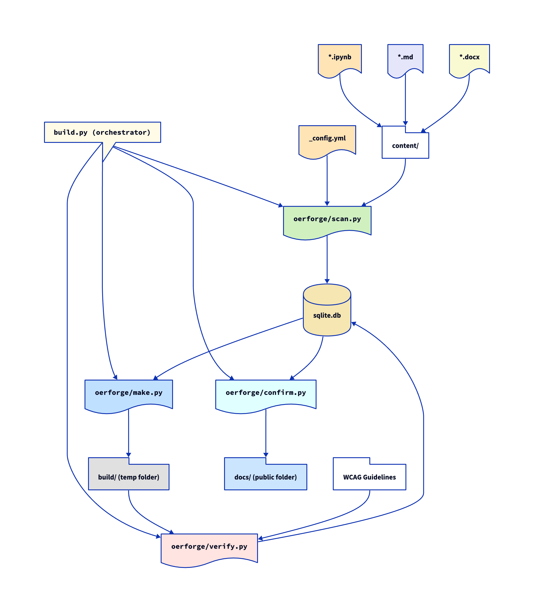

# OER-Forge

OER-Forge is a suite of tools to help authors create WCAG-compliant Open Educational Resources (OERs). The project is currently under development.

Below we describe the build system and its components; note that only `scan.py` and parts of `convert.py` are currently functional. And `convert.py` currently only supports conversion of Jupyter Notebooks (`.ipynb`) to Markdown (`.md`) and Word (`.docx`).

## OER-Forge Build System

OER-Forge is a Python package with five modules (`oerforge/`):

- `scan.py` - uses `_config.yml` and the files present in `content/` to populate an sqlite database with site and file info.
- `convert.py` - draws from `sqlite.db` to convert files in `content/` and places them in `build/files/` preserving the user's file structure
- `make.py` - draws from `sqlite.db` to builds a temporary WCAG compliant site in `build/`.
- `verify.py` - reviews `build/` in the context of WCAG Guidelines to generate a report and update pages on the site indicating level of compliance.
- `confirm.py` - integrates the WCAG reporting information into the site and rebuilds as a public site in `docs/`

### Orchestration

OER-Forge uses `build.py` to orchestrate the build process.
- `build.py` - uses functions from each module to construct the build in `build/`

### Overview of the Build Process

The following diagram illustrates the envisioned build process:

1. Starting with the `content/` directory and `_config.yml`, `scan.py` populates `sqlite.db`. This includes metadata about the site and the files to be processed as well as their locations. Figures and images are also identified and catalogued. **This is functional.**
2. `convert.py` reads from `sqlite.db` to convert files in `content/` to their appropriate formats, placing them in `build/files/` while preserving the user's file structure. The tools in `convert.py` currently support conversion of Jupyter Notebooks (`.ipynb`) to Markdown (`.md`) and Word (`.docx`), and will be extended to support additional formats. The module `convert.py` uses the file extensions to determine the appropriate conversion tools and which formats to convert to (i.e., it will not attempt to convert a `.md` file to `.md` or a `.docx` file to `.ipynb`). **This is partially functional.**
3. `make.py` reads from `sqlite.db` to build a temporary WCAG compliant site in `build/`. **This is not yet functional.**
4. `verify.py` reviews `build/` in the context of WCAG Guidelines to generate a report and update pages on the site indicating level of compliance. **This is not yet functional.**
5. `confirm.py` integrates the WCAG reporting information into the site and rebuilds as a public site in `docs/`. **This is not yet functional.**

### Build System Punchlist

- [X] `scan.py` can read `content/` and `_config.yml` to populate `sqlite.db`
- [ ] `convert.py` can convert files in `content/` to their appropriate forms
    - [X] `convert.py` can convert `.ipynb` to `.md` with images
    - [X] `convert.py` can convert `.ipynb` to `.docx` with images
    - [ ] `convert.py` can convert `.ipynb` to `.tex` with images
    - [ ] `convert.py` can convert `.ipynb` to `.pdf` with images
    - [ ] `convert.py` can convert `.docx` to `.md` with images
    - [ ] `convert.py` can convert `.docx` to `.tex` with images
    - [ ] `convert.py` can convert `.docx` to `.pdf` with images
    - [ ] `convert.py` can convert `.md` to `.docx` with images
    - [ ] `convert.py` can convert `.md` to `.tex` with images
    - [ ] `convert.py` can convert `.md` to `.pdf` with images
- [ ] `convert.py` can write location of converted files to `sqlite.db`
- [ ] `make.py` can build the initial WCAG compliant site to `build/`
- [ ] `verify.py` can traverse `build/` to indicate which page builds are ok
- [ ] `verify.py` can write build results to `sqlite.db` for each page
- [ ] `verify.py` can read WCAG guidelines in a parse-able way
- [ ] `verify.py` can traverse `build/` to evaluate level of WCAG compliance
- [ ] `verify.py` can write ECAG compliance levels to `sqlite.db` for each page
- [ ] `confirm.py` can read compliance levels and modify page to indicate current level
- [ ] `confirm.py` can generate a WCAG report on site and individual pages
- [ ] `confirm.py` can build public site to `docs/`
