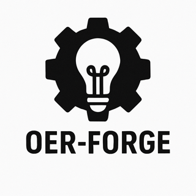

# OER-Forge

[OER-Forge](https://github.com/OER-Forge/) is a suite of tools to help authors create WCAG-compliant Open Educational Resources (OERs). The project is currently under development.

Below we describe the build system and its components; note that only `scan.py` and parts of `convert.py` are currently functional. And `convert.py` currently only supports conversion of Jupyter Notebooks (`.ipynb`) to Markdown (`.md`) and Word (`.docx`).

